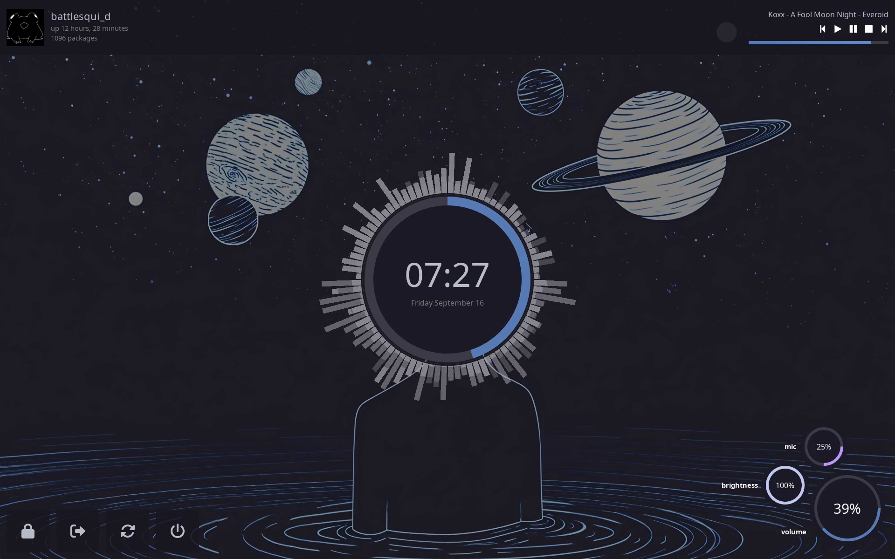

<div align="center">
    
    <hr>
    <p> My personal dotfiles managed with <a href="https://www.chezmoi.io/">chezmoi</a>.
    </p>
    <a href="https://github.com/Battlesquid/dotfiles/stargazers">
        
    </a>
    <a href="../LICENSE.md">
        
    </a>
</div>

### **NOTICE**
These dotfiles and the instructions on how to set them up are still under construction, and testing is still being done. Proceed with caution.

<br>



# **Details**

- **Window Manager** - [bspwm](https://github.com/baskerville/bspwm)
- **Compositor** - [picom](https://github.com/yshui/picom)
- **Shell** - [zsh](https://wiki.archlinux.org/title/zsh)
- **Terminal** - [kitty](https://github.com/kovidgoyal/kitty)
- **Bar and Widgets** - [eww](https://github.com/elkowar/eww)
- **Launcher** - [rofi](https://github.com/davatorium/rofi)
- **Notification Daemon** - [dunst](https://github.com/dunst-project/dunst)

# **Setup**

These setup steps use [paru](https://github.com/Morganamilo/paru), but feel free to use your AUR helper of choice.

### **WARNING:**

Be sure to back up any relevant files before continuing. Chezmoi will ask what you should do if a conflict occurs, but back up your files just in case. You can see what will be applied at a glance with `chezmoi status` and `chezmoi diff`.

## **Single Line Installation**
```bash
sh -c "$(curl -fsSL https://raw.githubusercontent.com/Battlesquid/dotfiles/main/install.sh)"
```

## **Manual Installation**

Install dependencies:
```bash
paru -S chezmoi xorg bspwm picom-animations-git kitty eww rofi dunst redshift pamixer xorg-xinit networkmanager noto-fonts nerd-fonts-noto-sans-mono ttf-font-awesome brightnessctl cava glava neofetch neovim sxhkd betterlockscreen flameshot feh playerctl jq recode moreutils jgmenu xcolor bluez-utils
```

Fetch the dotfiles using:
```bash
chezmoi init https://github.com/Battlesquid/dotfiles.git
```

Confirm the changes that will be made.
```bash
chezmoi diff
```

Install with:
```bash
chezmoi apply -v
```

Logout of your session and then start with:
```bash
startx
```

## **Custom Installation**

If you wish to manually move/symlink/view the dotfiles source, you can generate an archive of the source. For example:

```bash
chezmoi cd
chezmoi --source-path archive src/**/* --output=~/dotconfig.tar.gz
```

The archive will be in your home directory. This can be done with any folder/file in the source directory, so you can choose how to build out your archive. You can see a full list of potential archive targets with `chezmoi managed`.

## **Miscellaneous**

### **Weather widget**

1. [Grab an OpenWeather API key](https://openweathermap.org/api). Also determine the [city](https://openweathermap.org/current#name) you would like to use.
2. Create a `secrets` file with:
```
touch ~/.config/eww/fool_moon/common/scripts/secrets
```
3. Copy the contents below into the secrets file, substituting in the API key and city.
```bash
#!/bin/sh

WEATHER_API_KEY="<YOUR_API_KEY_HERE>"
WEATHER_API_CITY="<YOUR_CITY_HERE>"
```

### **GTK theme and icons**

You can acess the GTK theme I made for this rice [here](https://github.com/Battlesquid/gtk). I use the [Papirus](https://github.com/PapirusDevelopmentTeam/papirus-icon-theme) icon theme.

# **Credits**

Feel free to use anything in this repo, just be sure to provide proper credit.

Some scripts/config files were borrowed/adapted from the following repos:
- [adi1090x/widgets](https://github.com/adi1090x/widgets)
- [Syndrizzle/hotfiles](https://github.com/Syndrizzle/hotfiles)
- [mmsaeed509/bspwm-dots](https://github.com/mmsaeed509/bspwm-dots)
- [saimoomedits/eww-widgets](https://github.com/saimoomedits/eww-widgets)
- [janleigh/dotfiles](https://github.com/janleigh/dotfiles)

# **Contributing**

Since these are my dotfiles, I will not review/implement changes that fundamentally change how the configuration is set up. However, if you find a problem/inconsistency that can be improved without fundamentally changing the configuration (i.e., fixing a script to handle an edge-case), feel free to open an issue or PR.

